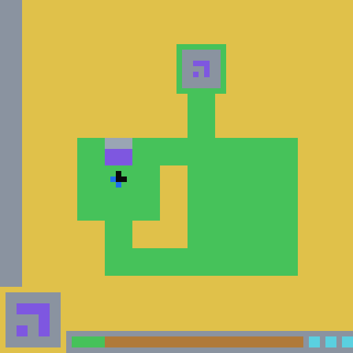
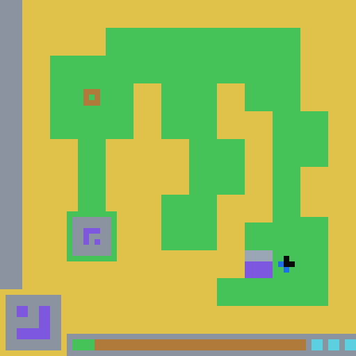
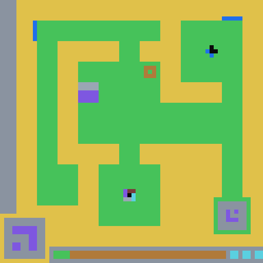
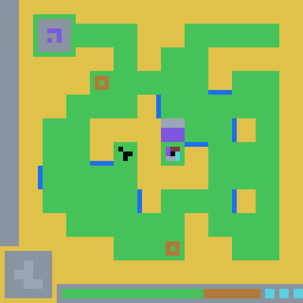
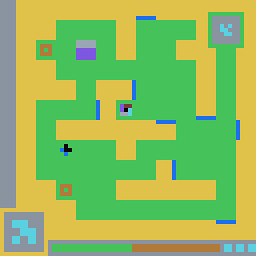
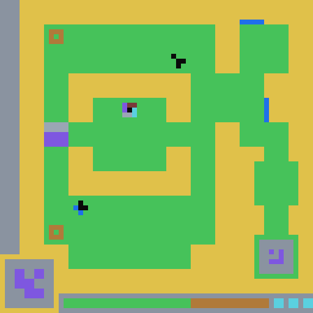
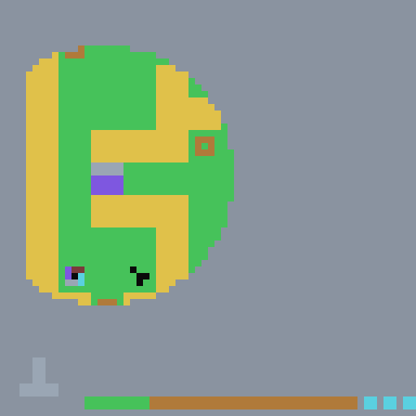

# 🔬 ARA-Demo
### Two complete Agent-Native Research Artifacts, produced by AI agents doing real research

> An **Agent-Native Research Artifact (ARA)** is a research knowledge package whose primary
> reader is an AI agent, not a human. Instead of a single paper, it stores the research as
> structured, machine-readable layers: the current best understanding (`logic/`), the full
> journey that produced it — dead ends included (`trace/`), and grounded proof (`evidence/`).
> Each demo here also ships a human-facing `PAPER.md` and a self-contained interactive
> `trajectory.html`.

---

## 🎮 Demo 1 — `arc-agi3/`: an agent plays Locksmith and writes its own manual

  
  
  
  
  
  
  

An AI agent (Claude Code / Opus) played the ARC-AGI-3 game **`ls20` (Locksmith)** with no
tutorial and cleared **all 7 levels**. The ARA in [`arc-agi3/ls20/`](arc-agi3/ls20/) was built
**live, during play** — and the agent then used it as a *world model* to crack the levels it
could not solve cold (L4, L6, L7). An ablation on the unseen L7 showed a recipes-only agent
never operated a single lock control, while the world-model agent characterized the whole
lock: the ARA earns its keep as a world model, not a trajectory cache.

| | |
|---|---|
| 📖 Showcase | [*The Locksmith That Wrote Its Own Manual*](https://www.agenticresearch.sh/raw/ARA-Labs/ARA-Demo/arc-agi3/index.html) (English / 中文) |
| 🗺️ Trajectory viewer | [75-node exploration tree, 19 dead ends, per-step evidence](https://www.agenticresearch.sh/raw/ARA-Labs/ARA-Demo/arc-agi3/ls20/trajectory.html) |
| ⚔️ L7 ablation | [world-model agent vs recipes-only agent](https://www.agenticresearch.sh/raw/ARA-Labs/ARA-Demo/arc-agi3/l7_showcase.html) |
| 📄 Write-up | [`arc-agi3/ls20/PAPER.md`](arc-agi3/ls20/PAPER.md) |

---

## 🚀 Demo 2 — `nanogpt_ara/`: an autonomous optimizer-search speedrun

  

An ARA compiled from an autonomous agent's optimizer search on the fixed-architecture
**modded-nanogpt `track_3_optimization`** benchmark. Starting from the Muon baseline
(3500 steps to 3.28 validation loss), the agent produced statistically-validated records at
**3205 → 3037 → 2949 steps** (v1/v2/v3), plus a documented terminal negative result from a
hard-isolated novelty-constrained wave.

| | |
|---|---|
| 🗺️ Trajectory viewer | [interactive process map of the search](https://www.agenticresearch.sh/raw/ARA-Labs/ARA-Demo/nanogpt_ara/trajectory.html) |
| 📄 Write-up | [`nanogpt_ara/PAPER.md`](nanogpt_ara/PAPER.md) |
| 📊 Evidence | [loss curves, pruning figures, record-seed tables](nanogpt_ara/evidence/) |

---

## 🔍 How to explore

Browse everything online on the [ARA Hub page for this repo](https://www.agenticresearch.sh/ara/ARA-Labs/ARA-Demo) —
the tables above link straight to the live viewers.

Everything is also static and self-contained — you can clone the repo and open the same HTML
files directly in a browser, or read the ARAs as plain Markdown: start with a demo's
`PAPER.md`, then dig into `logic/` (what is known), `trace/` (how it was learned, dead ends
and all), and `evidence/` (the proof).

## 🧬 Anatomy of an ARA

| Layer | What it holds |
|---|---|
| `PAPER.md` | Human-facing summary of the artifact |
| `logic/` | Current best understanding: claims, concepts, problem, solution recipes |
| `trace/` | Append-only research journey: exploration tree, session records, raw notes |
| `evidence/` | Grounded proof: verbatim numbers, figures, tables |
| `trajectory.html` | Self-contained interactive visualization of the whole process |

## 🔗 Related ARA-Labs resources

- [Agent-Native-Research-Artifact](https://github.com/ARA-Labs/Agent-Native-Research-Artifact)
  — the main repository: ARA specification and the agent skills that produce, query, and
  visualize ARAs
- [*The Last Human-Written Paper: Agent-Native Research Artifacts*](https://arxiv.org/abs/2604.24658)
  — the paper introducing ARAs
- [ARA Hub](https://www.agenticresearch.sh/) — browse published ARAs online
- [aracommons.com](https://aracommons.com) — ARA Commons
