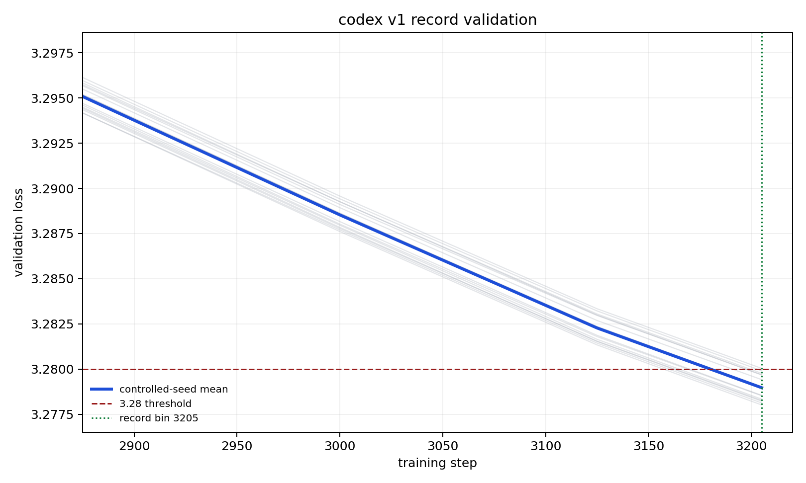

# Figure — v1 record validation loss curve

- **Source:** `record_configs/20260515_codex_v1_v12iso_3205/loss_curves.png` (the submitted v1 record).
- **Figure type:** quantitative_plot (line plot with a confidence band).
- **Extraction method:** visual_description + exact_from_labels (axis endpoints and the annotated record
  bin); per-step values are not printed, so curve readings are approximate (≈).
- **Reading confidence:** high for the threshold-crossing and the record bin; medium for intermediate
  loss values.

**What it shows.** Title "codex v1 record validation". X-axis = training step (≈2875 → ≈3210);
Y-axis = validation loss (≈3.2800 → ≈3.2975), linear. A bold blue line is the **controlled-seed mean**;
a light grey band around it is the seed spread. A red dashed horizontal line marks the **3.28 threshold**;
a green dotted vertical line marks the **record bin 3205**. The mean descends roughly linearly and
crosses the 3.28 threshold at the green line (≈step 3205), i.e. the n=16 cohort mean reaches target at
the submitted bin. Legend: "controlled-seed mean", "3.28 threshold", "record bin 3205".

**Supports:** C01 (the descending mean reaches target at the forced stop), C06 (the cohort mean, not a
single seed, defines the crossing). Exact cohort stats: [../tables/v1_record_seeds.md](../tables/v1_record_seeds.md).
