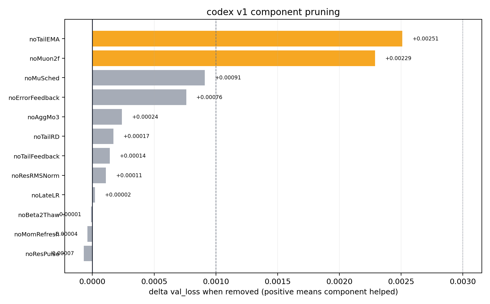

# Figure — v1 component pruning (leave-one-out)

- **Source:** `record_configs/20260515_codex_v1_v12iso_3205/pruning.png` (data: same dir's
  `pruning_data.json`; the "pruning-rerun codex v1 sweep" at the 3195-step screen, n=8).
- **Figure type:** quantitative_plot (horizontal bar chart).
- **Extraction method:** exact_from_labels — each bar carries its printed Δ value; cross-checked against
  `pruning_data.json`.
- **Reading confidence:** high (data labels printed and matched to the JSON).

**What it shows.** Title "codex v1 component pruning". X-axis = "delta val_loss when removed (positive
means component helped)", 0.0000 → ≈0.0030. Each bar is one modifier removed (leave-one-out). Bars,
largest→smallest: **noTailEMA +0.00251**, **noMuon2f +0.00229** (both highlighted orange as the
load-bearing pair), then noMuSched +0.00091, noErrorFeedback +0.00076, noAggMo3 +0.00024, noTailRD
+0.00017, noTailFeedback +0.00014, noResRMSNorm +0.00011, noLateLR +0.00002, noBeta2Thaw −0.00001,
noMomRefresh −0.00004, noResPulse −0.00007. A dashed vertical line marks the noise-floor scale
(≈0.0010).

**Reading:** tail-EMA evaluation and factorized hidden preconditioning are the two components whose
removal hurts most; the bottom three (beta2-thaw, mom-refresh, res-pulse) are at/below zero — droppable.

**Supports:** C02 (noTailEMA largest), C03 (noMuon2f second), C09 (the droppable tail). Full table:
[../tables/v1_component_pruning.md](../tables/v1_component_pruning.md).
