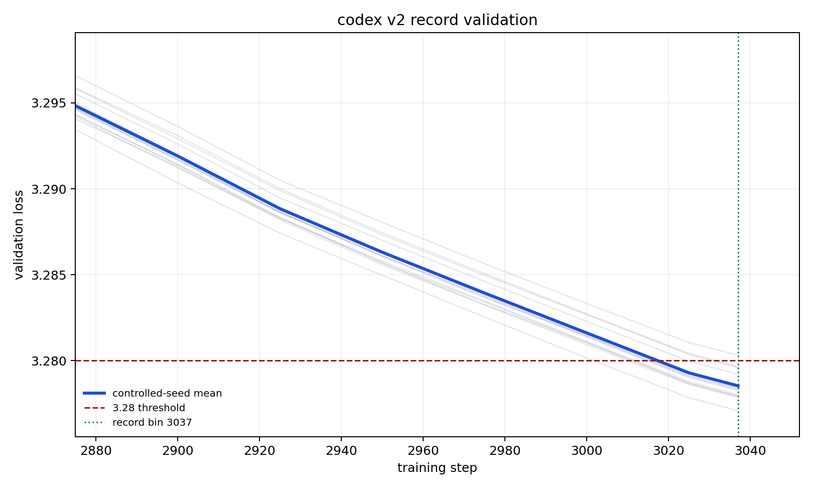

# Figure — v2 record validation loss curve

- **Source:** `record_configs/20260515_codex_v2_legal_3037/loss_curves.png` (the submitted v2 "legal" record).
- **Figure type:** quantitative_plot (line plot with seed traces).
- **Extraction method:** visual_description + exact_from_labels (axis endpoints, annotated record bin);
  intermediate readings approximate (≈).
- **Reading confidence:** high for the crossing/bin; medium for intermediate values.

**What it shows.** Title "codex v2 record validation". X-axis = training step (≈2875 → ≈3045);
Y-axis = validation loss (≈3.280 → ≈3.295), linear. A bold blue **controlled-seed mean** descends through
faint grey per-seed traces; a red dashed line marks the **3.28 threshold**; a green dotted vertical line
marks the **record bin 3037**. The mean crosses 3.28 just before the green line and the cohort settles
slightly below threshold at ≈3037. Legend: "controlled-seed mean", "3.28 threshold", "record bin 3037".

**Supports:** C06 (the cohort crossing defines the bin); C04 (this is the legal role-LR/WD + lookahead
stack). Exact cohort stats: [../tables/v2_record_seeds.md](../tables/v2_record_seeds.md).
