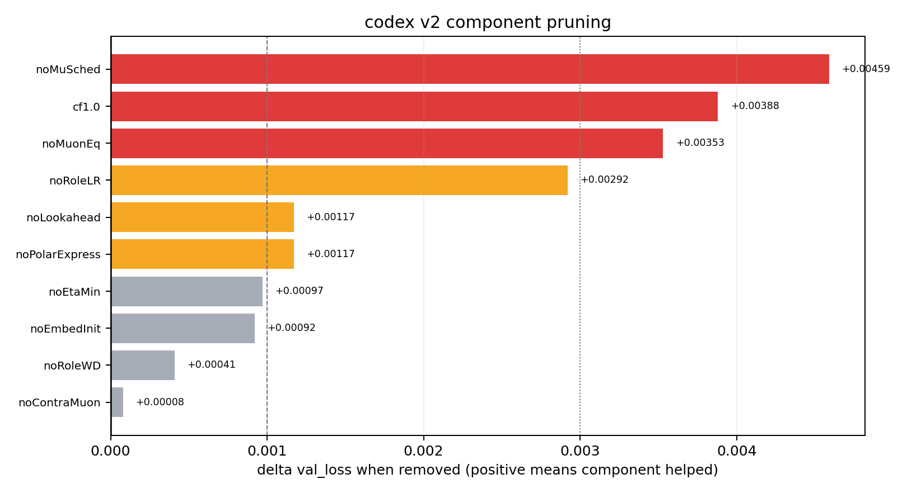

# Figure — v2 component pruning (leave-one-out)

- **Source:** `record_configs/20260515_codex_v2_legal_3037/pruning.png` (data: `pruning_data.json`;
  "pruning-rerun codex v2 legal sweep at step 3037", n=8; cf1.0 and noMuSched at n=3).
- **Figure type:** quantitative_plot (horizontal bar chart).
- **Extraction method:** exact_from_labels — printed Δ labels cross-checked against `pruning_data.json`.
- **Reading confidence:** high.

**What it shows.** Title "codex v2 component pruning". X-axis = "delta val_loss when removed (positive
means component helped)", 0.000 → ≈0.0046. Bars largest→smallest: **noMuSched +0.00459**, **cf1.0
+0.00388** (cooldown floor), **noMuonEq +0.00353** (these three red, the most load-bearing),
**noRoleLR +0.00292** (orange), noLookahead +0.00117, noPolarExpress +0.00117, noEtaMin +0.00097,
noEmbedInit +0.00092, noRoleWD +0.00041, noContraMuon +0.00008. Dashed/ dotted vertical guides at
≈0.001 and ≈0.003.

**Reading:** the inherited mu-schedule, cooldown floor, and MuonEq dominate; **role-specific LR** is the
largest *v2-specific* addition; Contra-Muon is nearly free. (Inherited MuonEq/μ-schedule are the largest
contributors; lookahead and role-LR/WD are the v2 additions — matching the record README's stack-contribution note.)

**Supports:** C04 (noRoleLR / noLookahead), C09 (Contra-Muon droppable-tier). Full table:
[../tables/v2_component_pruning.md](../tables/v2_component_pruning.md).
