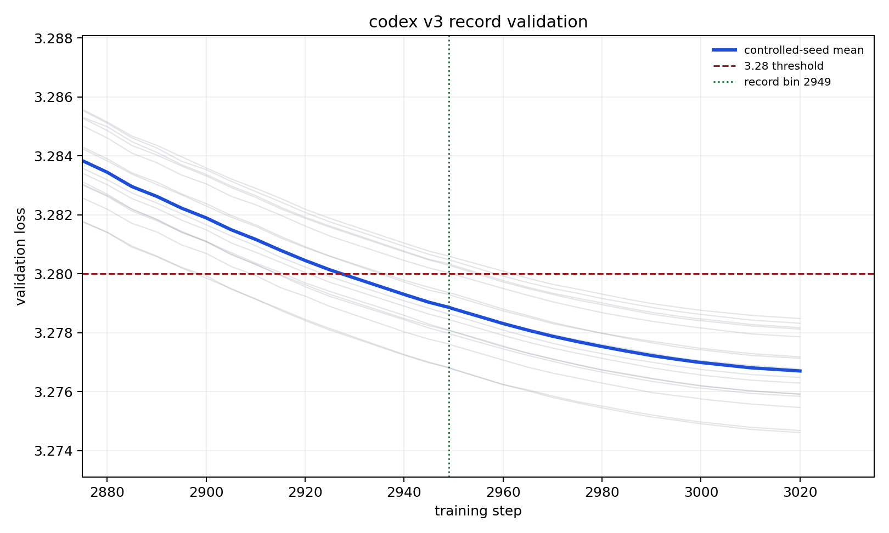

# Figure — v3 record validation loss curve

- **Source:** `record_configs/20260515_codex_v3_nosphere_2949/loss_curves.png` (the submitted v3
  "nosphere" record).
- **Figure type:** quantitative_plot (line plot with seed traces).
- **Extraction method:** visual_description + exact_from_labels (axis endpoints, annotated record bin);
  intermediate readings approximate (≈).
- **Reading confidence:** high for the crossing/bin; medium for intermediate values.

**What it shows.** Title "codex v3 record validation". X-axis = training step (≈2880 → ≈3020);
Y-axis = validation loss (≈3.274 → ≈3.288), linear. A bold blue **controlled-seed mean** descends
through ≈16 faint grey per-seed traces; a red dashed line marks the **3.28 threshold**; a green dotted
vertical line marks the **record bin 2949**. The mean crosses 3.28 around the green line and continues
down to ≈3.2767 by step 3020 (the runs train to `train_steps=3020`; the submitted bin is the logged
step-2949 checkpoint). Legend: "controlled-seed mean", "3.28 threshold", "record bin 2949".

**Supports:** C06 (the cohort crossing at 2949), C07/C08 (the compressed public-PR parent). Exact cohort
stats (steps 2949 and 3020): [../tables/v3_record_seeds.md](../tables/v3_record_seeds.md).
